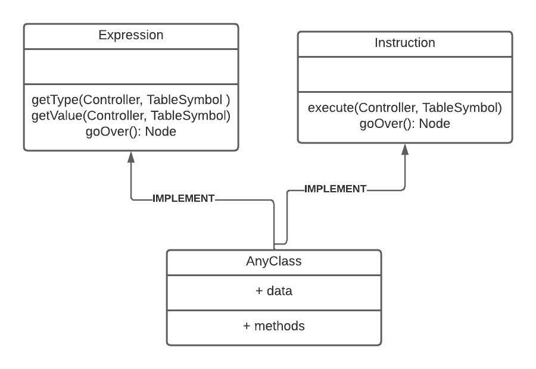

# **Proyecto 2**
### Universidad de San Carlos de Guatemala
### Facultad de Ingeniería
### Escuela de Ciencias y Sistemas
### Organización de Lenguajes y Compiladores 1
### Sección C
| Nombre | Carnet | 
| --- | --- |
| Alvaro Norberto García Meza | 202109567 |
----
# **Manual Técnico**

## **Introducción** 
El proyecto consiste en el desarrollo de un interprete para el lenguaje de programación **TypeWise**. El interprete es capaz de leer un archivo de texto con extensión **.tw** y ejecutarlo. El interprete es capaz de ejecutar instrucciones y expresiones de un lenguaje nativo, tales como:

- Declaración de variables
- Asignación de variables
- Operaciones aritméticas
- Operaciones lógicas
- Operaciones relacionales
- Estructuras de control
- Funciones
- Estructuras de datos
- Instrucciones ciclicas
- Instrucciones de salto
- Instrucciones de entrada y salida
- Instrucciones de llamada a función

## **Requerimientos del Software**
- Sistema operativo Windows 10 o superior
- Navegador web Google Chrome
- Node.js
- NPM
- React.js
- Graphviz
- Typescript

## *Librerías utilizadas*
- [React.js](https://reactjs.org/)
- [Typescript](https://www.typescriptlang.org/)
- [Graphviz](https://graphviz.org/)
- [Jison](https://zaa.ch/jison/)
- [Tailwindcss](https://tailwindcss.com/)
- [Zustand](https://github.com/pmndrs/zustand)


## **Estructura del Código**
El proyecto fue desarrollado utilizando en su totalidad el framework para frontend React.js, el cual utiliza el lenguaje de programación Typescript. El proyecto se divide en dos carpetas principales, **interpreter** y **webapp**. La carpeta **interpreter** contiene el código fuente del interprete, mientras que la carpeta **webapp** contiene el código fuente de la aplicación web. A continuación se muestra la estructura de carpetas del proyecto:

```
.
├── src
│   ├── components
│   ├──├── Console.tsx
│   ├──├── FilesBar.tsx
│   ├──├── ListFiles.tsx
│   ├──├── Navar.tsx
│   ├──├── TextEditor.tsx 
│   ├── interpreter
│   ├──├── Abstract
│   ├──├──├── EXpression.ts
│   ├──├──├── Instruction.ts
│   ├──├── Analyzer
│   ├──├──├── analyzer.jison
│   ├──├──├── parser.ts
│   ├──├── AST
│   ├──├──├── AST.ts
│   ├──├──├── Errors.ts
│   ├──├──├── Node.ts
│   ├──├── Expressions
│   ├──├──├── DataStructures
│   ├──├──├──├── List.ts
│   ├──├──├──├── Vector.ts
│   ├──├──├── Natives
│   ├──├──├── Operations
│   ├──├──├── Identifiers.ts
│   ├──├──├── Primitive.ts
│   ├──├──├── TernaryOperator.ts
│   ├──├── Instructions
│   ├──├──├── ControlSentences
│   ├──├──├── DataStructures
│   ├──├──├── LoopSentences
│   ├──├──├── TransferSentences
│   ├──├──├── Assigment.ts
│   ├──├──├── Callback.ts
│   ├──├──├── Cast.ts
│   ├──├──├── Declaration.ts
│   ├──├──├── Function.ts
│   ├──├──├── List.ts
│   ├──├──├── Main.ts
│   ├──├──├── Print.ts
│   ├──├──├── Vector.ts
│   ├── store
│   ├──├── resultStore.ts
│   ├── App.tsx
│   ├── index.css
│   ├── main.tsx
├── gitignore
├── index.html
├── package-lock.json
├── package.json
├── postcss.config.js
├── tailwind.config.js
├── tsconfig.json
└── webpack.config.js
```
## **Análisis Léxico**
El análisis léxico es el proceso de reconocer los tokens de una cadena de
entrada. Para este proyecto se utilizó la herramienta JISON para generar el
análisis léxico. JISON es una herramienta que permite generar analizadores
léxicos a partir de expresiones regulares.
devuelve un objeto de la clase Symbol, que contiene el token y su valor.

## **Análisis Sintáctico**
El análisis sintáctico es el proceso de reconocer la estructura de una
cadena de entrada. Para este proyecto se utilizó la herramienta JISON para generar el análisis sintáctico.
## **JISON**
Jison es un generador de analizadores léxicos y sintácticos para Javascript. Jison toma una descripción de gramática, escrita en formato BNF, y produce un programa Javascript que construye un árbol de análisis para reconocer cadenas que coincidan con la gramática. Jison es un fork de Bison, y Bison es un fork de Yacc. Jison fue escrito por Zach Carter, y es mantenido por Zach Carter y otros colaboradores.

## **Patrón de diseño**
Para el desarrollo del interprete se utilizó el patrón de diseño **Patrón interprete**. El patrón interprete es un patrón de diseño de software que, dado un lenguaje, define una representación para su gramática junto con un intérprete del lenguaje. Se usa para definir un lenguaje para representar expresiones regulares que representen cadenas a buscar dentro de otras cadenas. Este patrón usa una clase para representar cada regla gramatical. El intérprete usa la representación para interpretar las sentencias del lenguaje. A continuación se muestra el diagrama de clases del patrón interprete utilizado para el desarrollo del interprete: 




## **Gramática**
Para el desarrollo del interprete se utilizó una gramática libre de contexto, recursiva por la derecha (LR). La gramática fue desarrollada utilizando el lenguaje de programación Jison. A continuación se muestra la gramática en limpio utilizada para el desarrollo del interprete:

```
Terminales = {
  INIT, SENTENCES , SENTENCE, MAIN , DECLARATION, ASSIGNMENT, PRINT, INCDEC, IF, SWITCH, FOR, WHILE,
  DO_WHILE, FUNCTION, CALLBACK, TYPE, EXP, LISTEXP, CASE_LIST, DEFAULT, DEC_ASSING_FOR, LIST_PARAM
}

No Terminales = {
  t_break, t_continue, t_return, id, '=', '(', ')', '{', '}', ';', ',', '[', ']', '++', '--', 
  't_print', 't_if', 't_else', 't_switch', 't_case', 't_default', 't_for', 't_while', 't_do', 't_void', 't_int', 't_double', 
  't_boolean', 't_char', 't_string', 't_true', 't_false', '+', '-', '*', '/', '^', '%', '==', '!=', '<=', '>=', 
  '<', '>', '&&', '||', '!', '?', ':', 'new', 'list', 'toCharArray', 'add', 'toLower', 'toUpper', 'toString', 
  't_truncate', 't_round', 't_typeof', 't_length', 't_main', 't_return', 't_break', 't_continue', 't_print', 't_if', 't_else', 't_switch', 
  't_return', t_break , t_continue 
}

INIT -> SENTENCES

SENTENCES -> SENTENCES SENTENCE    

SENTENCE -> MAIN        
         | DECLARATION 
         | ASSIGNMENT  
         | PRINT       
         | INCDEC      
         | IF          
         | SWITCH       
         | FOR         
         | WHILE       
         | DO_WHILE    
         | FUNCTION    
         | CALLBACK    
         | t_break   
         | t_continue  
         | t_return    
         | t_return EXP

DECLARATION -> TYPE id '=' EXP
            | TYPE id 
            | TYPE id '=' '(' TYPE ')' EXP 
            | TYPE'['']' id '=' t_new TYPE'[' EXP ']'
            | TYPE'['']' id '=' '{' LISTEXP '}'
            | t_list '<' TYPE '>' id '=' t_new t_list '<' TYPE '>'
            | t_list '<' TYPE '>' id '=' t_toCharArray '(' EXP ')'

ASSIGNMENT -> id '=' EXP 
           | id '[' EXP ']' '=' EXP 
           | id '[''[' EXP ']'']' '=' EXP 

INCDEC    -> id '++'     
          | id '--'     
          

PRINT    -> t_print '(' EXP ')'


IF       -> t_if '(' EXP ')' '{' SENTENCES '}' 
          | t_if '(' EXP ')' '{' SENTENCES '}' t_else '{' SENTENCES '}' 
          | t_if '(' EXP ')' '{' SENTENCES '}' t_else IF 


SWITCH   -> t_switch '(' EXP ')' '{' CASE_LIST '}'             
          | t_switch '(' EXP ')' '{' CASE_LIST  DEFAULT '}'   
          | t_switch '(' EXP ')' '{' DEFAULT '}'              
          

CASE_LIST -> CASE_LIST CASE 
          | CASE 
          

CASE      -> t_case EXP ':' SENTENCES 
          

DEFAULT   -> t_default ':' SENTENCES 
      

FOR       -> t_for '(' DEC_ASSING_FOR  ';' EXP ';' UPDATE_FOR ')' '{' SENTENCES '}' 


DEC_ASSING_FOR -> TYPE id '=' EXP 
               | id '=' EXP 
               ;

UPDATE_FOR    -> id '++'   
               | id '--'   
               | id '=' EXP      


WHILE    -> t_while '(' EXP ')' '{' SENTENCES '}' 


DO_WHILE -> t_do '{' SENTENCES '}' t_while '(' EXP ')' ';' 


FUNCTION  -> TYPE id '(' LIST_PARAM ')' '{' SENTENCES '}'  
          | TYPE id '(' ')' '{' SENTENCES '}'          
          | t_void id '(' LIST_PARAM ')' '{' SENTENCES '}'
          | t_void id '(' ')' '{' SENTENCES '}'       

LIST_PARAM -> LIST_PARAM ',' TYPE id 
           | TYPE id 

CALLBACK  -> id '(' LISTEXP ')' 
          | id '(' ')' 
          | id '[' EXP ']'
          | id '[''[' EXP ']'']'
          | id '.' t_add '(' EXP ')' 
          | t_toLower '(' EXP ')'  
          | t_toUpper '(' EXP ')'  
          | t_toString '(' EXP ')' 
          | t_truncate '(' EXP ')' 
          | t_round '(' EXP ')'    
          | t_typeof '(' EXP ')'   
          | t_length '(' EXP ')'   

LISTEXP   -> LISTEXP ',' EXP
           | EXP

TYPE     -> tint     
          | tdouble  
          | tboolean 
          | tchar    
          | tstring  
          

MAIN      -> t_main CALLBACK 
          

EXP      -> EXP '+' EXP             
          | EXP '-' EXP           
          | EXP '*' EXP             
          | EXP '/' EXP           
          | EXP '^' EXP           
          | EXP '%' EXP            
          | '-' EXP 
          | INCDEC                 
          | '(' EXP ')'            
          | EXP '==' EXP           
          | EXP '!=' EXP           
          | EXP '<=' EXP           
          | EXP '>=' EXP           
          | EXP '<' EXP            
          | EXP '>' EXP            
          | EXP '&&' EXP           
          | EXP '||' EXP           
          | '!' EXP                
          | EXP '?' EXP ':' EXP    
          | CALLBACK               
          | id                     
          | integer                
          | float                 
          | words                  
          | character              
          | t_true                
          | t_false                

```


