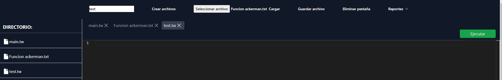

# **Proyecto 2**
### Universidad de San Carlos de Guatemala
### Facultad de Ingeniería
### Escuela de Ciencias y Sistemas
### Organización de Lenguajes y Compiladores 1
### Sección C
| Nombre | Carnet | 
| --- | --- |
| Alvaro Norberto García Meza | 202109567 |
----
# **Manual de Usuario**

## **Descripción General**
El proyecto consiste en el desarrollo de un interprete para el lenguaje de programación **TypeWise**. El interprete es capaz de leer un archivo de texto con extensión **.tw** y ejecutarlo. El interprete es capaz de ejecutar instrucciones y expresiones de un lenguaje nativo, tales como:
- Declaración de variables
- Asignación de variables
- Operaciones aritméticas
- Operaciones lógicas
- Operaciones relacionales
- Estructuras de control
- Funciones
- Estructuras de datos
- Instrucciones ciclicas
- Instrucciones de salto
- Instrucciones de entrada y salida
- Instrucciones de llamada a función
- Instrucciones de retorno de función
- Instrucciones de declaración de función

Es capaz de generar una salida con la tipica consola, ademas de reportes de errores, tabla de símbolos y gráfica de un árbol AST.

## **Requerimientos**
Un navegador web para visualizar, ejecutar y editar el código fuente del proyecto. Se recomienda utilizar el navegador Google Chrome.

## **Lenguaje**
Al ser un interprete para el lenguaje **TypeWise**, se debe utilizar la sintaxis del lenguaje para poder ejecutar el código. La sintaxis del lenguaje es una combinación entre Java y Javascript, donde se cuenta con tipado de datos y una función main para iniciar la ejecución del programa.

**Ejemplo de código:**
```javascript
// Declaración de variables
string a = "hola";
int b = 5;
double c = 5.5;
boolean d = true;
char e = 'a';
// asignación de variables
a = "adios";
b = 10;
c = 10.5;
d = false;
e = 'b';
// operaciones aritméticas
int f = b + 5;
double g = c + 5.5;
// operaciones lógicas
boolean h = d && true;
// operaciones relacionales
boolean i = b > 5;
// estructuras de control
// if
if (b > 5) {
    // instrucciones
} else if (b < 5) {
    // instrucciones
} else {
    // instrucciones
}
// switch
switch (b) {
    case 1:
        // instrucciones
        break;
    case 2:
        // instrucciones
        break;
    default:
        // instrucciones
        break;
}
// while
while (b > 5) {
    // instrucciones
}
// do while
do {
    // instrucciones
} while (b > 5);

// for
for (int i = 0; i < 10; i++) {
    // instrucciones
}
// funciones
int suma(int a, int b) {
  return a + b;
}
// metodos 
void suma(int a, int b) {
  print(a + b);
}
// estructuras de datos
// listas
ist<int> lista = new list<int>;
lista.add(1);
lista[0] = 2;
// vector
string[] vector = new string[5];
vector[0] = "hola";

// instrucciones de salto
// break
while (b > 5) {
    break;
}
// continue
while (b > 5) {
    continue;
}
// return
int suma(int a, int b) {
  return a + b;
}
// instrucciones de entrada y salida
// print
print("hola");
// funciones nativas
// print
print("hola");
// instrucciones de llamada a función
suma(1, 2);
// typeof
typeof(a);
// length
length(a);
// Round -> aproxima un numero decimal a un entero
round(5.5);
// toLower -> convierte un string a minusculas
toLower("HOLA");
// toUpper -> convierte un string a mayusculas
toUpper("hola");
// toString -> convierte un valor a string
toString(5);
// truncate -> trunca un numero decimal a un entero
truncate(5.5); 
// funcion main -> ejecuta el programa 
main funcion();
```
## **Pagina Web**
Al abrir el siguiente link:

Al abrir en el navegador el link del proyecto, se mostrara la siguiente pagina web:


## **Editor de Código**
En la parte del centro de la pagina web se encuentra el editor de código, donde se puede escribir el código fuente del programa a ejecutar. El editor de código cuenta con las siguientes funcionalidades:


- **Guardar archivo:** Permite guardar el código fuente en un archivo con extensión **.tw**.
- **Abrir archivo:** Permite abrir un archivo con extensión **.tw** y cargar el código fuente en el editor de código.
- **Ejecutar código:** Permite ejecutar el código fuente que se encuentra en el editor de código.
- **Crear Archivo:** Permite crear un archivo con extensión **.tw** y cargar el código fuente en el editor de código.
- **Eliminar Pestaña:** Permite eliminar la pestaña actual del editor de código.
- **Pestaña de reportes:** Permite visualizar los reportes generados por el interprete.

## **Consola**

En la parte inferior de la pagina web se encuentra la consola, donde se muestra la salida del programa ejecutado. La consola cuenta con las siguientes funcionalidades:

 

- **Resultado de ejecución:** Muestra el resultado de la ejecución del programa.
- **Errores:** Muestra los errores *Semánticos* que se generaron durante la ejecución del programa.


## **Reportes**
En la parte derecha de la pagina web se encuentran los reportes generados por el interprete. Los reportes que se generan son los siguientes:


- **Tabla de símbolos:** Muestra la tabla de símbolos generada durante la ejecución del programa.
    

- **Árbol AST:** Muestra el árbol AST generado durante la ejecución del programa.
    

- **Errores:** Muestra los errores *Sintácticos* y *Léxicos* que se generaron durante la ejecución del programa.

## **Manejo de pestañas**
El editor de código permite manejar múltiples pestañas, donde cada pestaña puede contener un archivo con extensión **.tw**. Para crear una nueva pestaña se debe presionar el botón de **Crear Archivo**. Para abrir un archivo con extensión **.tw** se debe presionar el botón de **Abrir Archivo**. Para guardar el código fuente de una pestaña se debe presionar el botón de **Guardar Archivo**. Para eliminar una pestaña se debe presionar el botón de **Eliminar Pestaña**.



## **Ejecución de código**
Para ejecutar el código fuente, se debe escribir el código en el editor de código y presionar el botón de **Ejecutar**. Al presionar el botón de ejecutar código, se mostrara el resultado de la ejecución en la consola.


## **Tabla de símbolos**
La tabla de símbolos muestra la información de las variables declaradas en el programa. La tabla de símbolos muestra la siguiente información:


- **Identificador:** Nombre de la variable.
- **Tipo:** Tipo de la variable.
- **Rol:** El rol que llena.
- **Valor:** Valor de la variable.
- **Fila:** Fila donde se declaro la variable.
- **Columna:** Columna donde se declaro la variable.

## **Árbol AST**
El árbol AST muestra la estructura del programa.


## **Errores**
Los errores que se muestran en la pestaña de errores son los errores *Sintácticos* y *Léxicos* que se generaron durante la ejecución del programa. Los errores se muestran de la siguiente manera:


- **Tipo de error:** Tipo de error que se genero.
- **Descripción:** Descripción del error.
- **Fila:** Fila donde se genero el error.
- **Columna:** Columna donde se genero el error.